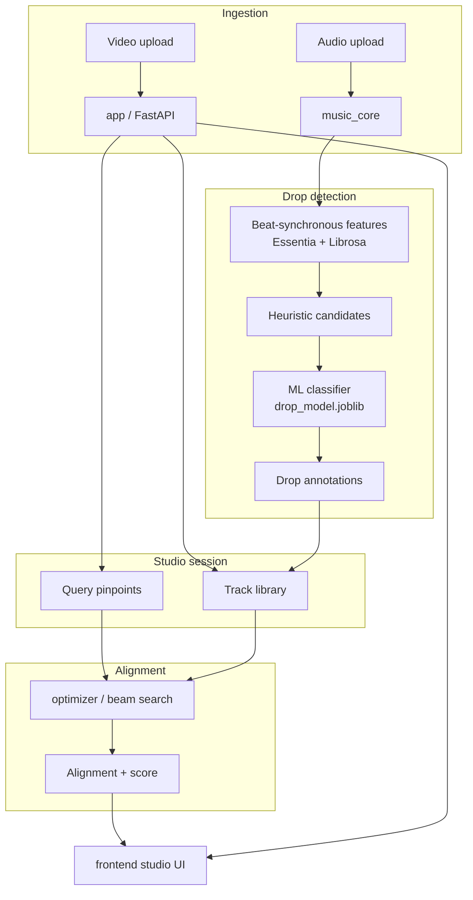

# Music Matcher

**Align music drop points to video cue times using custom ML and combinatorial optimization.**

Music Matcher is an end-to-end system for a problem that does not have an off-the-shelf solution: given a video timeline with visual cue points (“pinpoints”), automatically find and align songs whose **drops** land on those moments. The project spans audio ML research, a domain-specific optimizer, a FastAPI application layer, a React studio UI, and a packaged desktop app.

**Linux:** a pre-built **AppImage** is available, see [Desktop app](#desktop-app) below.

---

## Demo

> **TODO:**


| Demo               | What to show                                                                                                         | Link               |
| ------------------ | -------------------------------------------------------------------------------------------------------------------- | ------------------ |
| **Full workflow**  | Upload tracks → review detected drops → create a studio → place video cue points → run optimizer → inspect alignment | **[Watch demo]()** |
| **Drop detection** | Audio upload, beat-level drop suggestions, manual correction of annotations                                          | **[Watch demo]()** |
| **Optimizer**      | Studio session, query pinpoints, alignment result and score breakdown                                                | **[Watch demo]()** |
| **Desktop app**    | Launch AppImage/installer, no terminal, data persists across sessions                                                | **[Watch demo]()** |


---

## The problem

Video editors often want music **drops** (energy releases / “explosion” moments) to hit specific visual beats. Generic audio APIs expose loudness, tempo, or structure, but not a **drop score**. There is no standard dataset or pretrained model for this task.

Music Matcher tackles the full pipeline:

1. **Detect** musically meaningful drop regions at beat resolution.
2. **Define** a video/session timeline with target cue points.
3. **Optimize** which tracks to use and how to place them so annotated drops align with those cues under a custom objective.

---

## Results at a glance


| Component          | Approach                                                                                     | Result                                                            |
| ------------------ | -------------------------------------------------------------------------------------------- | ----------------------------------------------------------------- |
| **Drop detection** | Heuristic bootstrap → active learning → scikit-learn classifier on beat-synchronous features | **F1 0.785** on held-out tracks ([methodology](docs/results.md)) |
| **Labeling**       | Iterative human labeling at beat granularity                                                 | **~1,500** labeled beat regions                                   |
| **Alignment**      | Beam search over track subset + temporal placement                                           | Multi-factor score (drops, gaps, overlap, BPM, style, preference) |
| **Application**    | FastAPI + persistent storage + React studio + Electron                                       | **Linux AppImage built** (v0.1.0); Windows installer supported via build |


Details, eval protocol, and metrics: **[docs/results.md](docs/results.md)**

---

## Architecture




### Repository map


| Module                       | Responsibility                                                      |
| ---------------------------- | ------------------------------------------------------------------- |
| `[music_core/](music_core/)` | Audio loading, feature extraction, heuristic + ML drop inference    |
| `[music_drop/](music_drop/)` | Labeling UI, active learning, training scripts, evaluation          |
| `[optimizer/](optimizer/)`   | Domain-agnostic segment alignment engine (query ↔ tracks)           |
| `[app/](app/)`               | FastAPI routes, services, filesystem storage, orchestration         |
| `[frontend/](frontend/)`     | React studio: track library, annotation editor, studio/alignment UI |
| `[electron/](electron/)`     | Desktop shell: spawns backend, loads UI                             |
| `[docs/](docs/)`             | Architecture, ML workflow, optimizer, API, results                  |


Deep dives:

- [Architecture](docs/architecture.md)
- [Drop detection pipeline](docs/drop-detection.md)
- [Training & active learning](docs/training-workflow.md)
- [Optimizer](docs/optimizer.md)
- [API](docs/api.md)
- [Evaluation & metrics](docs/results.md)
- 
---

## Technical story

### 1. Drop detection (`music_core` + `music_drop`)

There was no existing “drop detector” to plug in. The pipeline evolved in stages:

1. **Heuristic baseline**, sliding windows over beat-synchronous energy, onset, spectral centroid, and bass features; combined into a hand-tuned score (~50% subjective accuracy).
2. **Cold-start labeling**, with no labels and no corpus, seeds were taken from high-heuristic beats only; a first classifier was trained on those windows.
3. **Active learning**, as the model improved, labeling expanded from heuristic-filtered beats to the full beat lattice; ~1.5k beat regions labeled manually.
4. **Production inference**, heuristic phased out for selection; `music_core` loads a persisted `drop_model.joblib` and filters beats by model confidence, gap constraints, and non-max suppression.

Features are aligned to **beats**, not raw samples, drops are predicted as beat-index regions, which matches how alignment works downstream.

### 2. Alignment optimizer (`optimizer`)

The optimizer is intentionally **decoupled from audio**. It operates on typed domain objects:

- **Query**, session length + pinpoint annotations (e.g. video cue drops).
- **Track library**, tracks with segment metadata and their own pinpoint annotations.
- **Alignment**, chosen subset of tracks, start times, speeds, and mapped points.

A **beam search** explores placements; each state is scored by a composite function weighting drop match quality, gaps, overlaps, BPM fit, style similarity, and user preference. See [docs/optimizer.md](docs/optimizer.md).

### 3. Application layer (`app`)

Coordinates everything behind a REST API:

- Track upload, feature extraction, drop detection
- Studio sessions, query editing, video upload
- Optimizer runs and persisted alignment results
- Filesystem-backed storage with OS user-data directory (survives app updates)

### 4. Studio UI (`frontend` + `electron`)

React app for the full interactive loop. Packaged with Electron as a local desktop app, users run one binary, not separate backend/frontend terminals.

---

## Desktop app

A **Linux AppImage** has been built and tested locally (`Music Matcher-0.1.0.AppImage`). It bundles the Python backend, drop model, and React UI, no separate terminal, Python install, or `npm run dev` required.

**Run the AppImage**

```bash
chmod +x "Music Matcher-0.1.0.AppImage"
./"Music Matcher-0.1.0.AppImage"
```

**Get it**

- **GitHub Releases:** [github.com/atigun64/music_matcher/releases](https://github.com/atigun64/music_matcher/releases) _(upload the AppImage here, it is not committed to the repo due to size)_
- **Build yourself:** see [Desktop packaging](#desktop-packaging) → output in `electron/release/`

User data is stored under `~/.local/share/music_matcher` and persists across app updates.

---

## Quick start (developers)

### Build the desktop app

```bash
pip install --user -r requirements.txt -r requirements-build.txt
cd frontend && npm install && cd ..
npm run electron:install
npm run electron:package:linux    # or electron:package:win on Windows
```

### Development (API + UI separately)

**Backend**

```bash
pip install -r requirements.txt
uvicorn app.api.app:app --reload --host 127.0.0.1 --port 8000
```

**Frontend**

```bash
cd frontend
npm install
npm run dev
```

Open [http://localhost:5173](http://localhost:5173), Vite proxies `/api` to the backend.

**Electron dev** (single window, spawns backend + Vite):

```bash
npm run electron:dev
```

### Drop model

The trained classifier ships with the repository as `drop_model.joblib` (~19 MB) at the project root. Retrain via scripts under `music_drop/scripts/`; training writes a new artifact to the same path.

Override at runtime with `MUSIC_MATCHER_MODEL_PATH` if needed.

---

## Desktop packaging


| Command                          | Output                                   |
| -------------------------------- | ---------------------------------------- |
| `npm run electron:package:linux` | AppImage in `electron/release/`          |
| `npm run electron:package:win`   | NSIS `.exe` installer (build on Windows) |


Build on the **target OS**. The Python backend is bundled with PyInstaller; the frontend is built to `frontend/dist/` and embedded in the Electron app.

User data is stored outside the install directory:


| OS      | Path                                          |
| ------- | --------------------------------------------- |
| Linux   | `~/.local/share/music_matcher`                |
| Windows | `%LOCALAPPDATA%\music_matcher`                |
| macOS   | `~/Library/Application Support/music_matcher` |


---

## Tech stack


| Layer      | Technologies                                                  |
| ---------- | ------------------------------------------------------------- |
| Audio / ML | Python, Essentia, Librosa, NumPy, SciPy, scikit-learn, joblib |
| API        | FastAPI, uvicorn, python-multipart                            |
| Optimizer  | Custom beam search, modular score functions                   |
| Frontend   | React, Vite, React Router                                     |
| Desktop    | Electron, electron-builder, PyInstaller                       |
| Storage    | JSON index + per-entity directories on local filesystem       |


---

## Project status


| Area              | Maturity                                        |
| ----------------- | ----------------------------------------------- |
| Drop detection ML | Research-grade; evaluated on custom labeled set |
| Optimizer         | Functional; tuned score weights                 |
| API & storage     | Stable for local / single-user use              |
| Studio UI         | Working prototype for demo and iteration        |
| Desktop packaging | **Linux AppImage v0.1.0 built**; Windows installer via `electron:package:win` |


This is a **working research prototype**, not a production video editor. The emphasis is on the ML problem, the alignment algorithm, and a credible end-to-end application shell.

---

## License

MIT, see [LICENSE](LICENSE).

---

## Citation / contact


**Author:** atigun
**Links:** atigun64@gmail.com

If you use or reference this work, a link back to this repository is appreciated.
